# Sisop-3-2026-IT-075


| Nama | NRP |
| --- | --- |
| Nayla Aisha Hanifa | 5027251075 |


---

### Soal 1


#### Deskripsi Soal

Membuat aplikasi **chat berbasis TCP socket** , terdiri dari server multithreaded (`wired.c`), client (`navi.c`), dan header konfigurasi bersama (`protocol.h`). Server mampu menangani banyak client secara bersamaan menggunakan `pthread`, menyiarkan pesan antar user, serta menyediakan fitur admin khusus.

---

#### Penjelasan

### `protocol.h` — Header Konfigurasi Bersama

File ini berisi semua konstanta yang digunakan bersama oleh `wired.c` (server) dan `navi.c` (client), sehingga tidak perlu mendefinisikan ulang di setiap file.

**Header Guard** digunakan untuk mencegah file ini diproses lebih dari satu kali oleh compiler, meskipun di-include di banyak tempat:

```c
#ifndef PROTOCOL_H
#define PROTOCOL_H
// ... isi file ...
#endif
```

**Konfigurasi jaringan:**

```c
#define SERVER_IP   "127.0.0.1"
#define SERVER_PORT 8080
```

`SERVER_IP "127.0.0.1"` adalah alamat *localhost*, artinya server dan client berjalan di komputer yang sama. `SERVER_PORT 8080` adalah nomor port yang digunakan.

**Batas kapasitas:**

```c
#define MAX_CLIENTS 30
#define BUFFER_SIZE 1024
```

`MAX_CLIENTS 30` membatasi jumlah user yang bisa terhubung secara bersamaan. `BUFFER_SIZE 1024` adalah ukuran buffer sementara untuk data yang dikirim/diterima (1024 byte = 1 KB).

**Admin:**

```c
#define ADMIN_NAME  "The Knights"
#define ADMIN_PASS  "nayla120207"
```

Mendefinisikan nama dan password akun admin. Siapapun yang login dengan nama `"The Knights"` dan password yang benar akan mendapat akses fitur admin (lihat daftar user, cek uptime, emergency shutdown).

---

### `wired.c` — Server


```c
int koneksi_user[MAX_CLIENTS], total_user = 0, sedang_shutdown = 0;
char nama_user[MAX_CLIENTS][100];
time_t waktu_mulai;
pthread_mutex_t kunci_server = PTHREAD_MUTEX_INITIALIZER;
```

- `koneksi_user[30]` — array yang menyimpan *file descriptor* socket setiap user aktif
- `total_user` — penghitung berapa user yang sedang online
- `sedang_shutdown` — flag (0/1) untuk mencegah thread lain mengakses data saat server mati
- `nama_user[30][100]` — array 2D: 30 slot nama, masing-masing maksimal 100 karakter
- `waktu_mulai` — menyimpan waktu server pertama dinyalakan (untuk kalkulasi uptime)
- `kunci_server (mutex)` — "gembok" yang memastikan hanya satu thread yang bisa mengubah data bersama pada satu waktu, mencegah *race condition*

#### Fungsi `catat_log()`

```c
void catat_log(const char* tag, const char* pesan) {
    FILE* f = fopen("history.log", "a");
    if(!f) return;
    time_t sekarang = time(NULL);
    char jam[25];
    strftime(jam, 25, "%Y-%m-%d %H:%M:%S", localtime(&sekarang));
    fprintf(f, "[%s] [%s] [%s]\n", jam, tag, pesan);
    fclose(f);
}
```

Fungsi ini dipanggil setiap kali ada event penting untuk mencatat aktivitas ke file `history.log`. `fopen("history.log", "a")` membuka file dengan mode *append* (menambah di akhir, tidak menghapus isi lama). `time(NULL)` mengambil waktu sekarang sebagai Unix timestamp, lalu `strftime()` mengubahnya ke format yang terbaca (`2026-04-29 10:41:00`). Setiap baris log mengikuti format: `[timestamp] [tag] [pesan]`.

#### Fungsi `tangani_client()`

Fungsi ini berjalan di **thread tersendiri untuk setiap client** yang terhubung.

**Tahap registrasi nama:**

```c
void* tangani_client(void* arg) {
    int socket_saya = (int)(long)arg;
    // ...
    while (1) {
        if (recv(socket_saya, nama, 100, 0) <= 0) {
            close(socket_saya); return NULL;
        }
        pthread_mutex_lock(&kunci_server);
        int sudah_ada = 0;
        for(int i = 0; i < total_user; i++) {
            if(strcmp(nama_user[i], nama) == 0) sudah_ada = 1;
        }
        if (sudah_ada) { /* kirim error, lanjut loop */ continue; }
        strncpy(nama_user[total_user], nama, 99);
        koneksi_user[total_user++] = socket_saya;
        pthread_mutex_unlock(&kunci_server);
        break;
    }
```

 Server akan terus meminta nama hingga nama yang valid (tidak duplikat) diterima. Setiap kali mengakses atau memodifikasi array bersama, `pthread_mutex_lock()` dipanggil untuk mengunci gembok, dan `pthread_mutex_unlock()` untuk membukanya kembali setelah selesai. Jika oke, nama disimpan dan socket dimasukkan ke daftar `koneksi_user`.

**Tahap chat dan broadcast:**

```c
    while (1) {
        int byte_masuk = recv(socket_saya, buffer, BUFFER_SIZE, 0);
        if (byte_masuk <= 0) { /* hapus user dari array, tutup socket */ }

        if (strcmp(nama, ADMIN_NAME) == 0) {
            if (buffer[0] == '1') { /* lihat daftar user */ }
            else if (buffer[0] == '2') { /* cek uptime */ }
            else if (buffer[0] == '3') { /* emergency shutdown */ }
        } else {
            sprintf(balasan, "[%s]: %s", nama, buffer);
            for(int i = 0; i < total_user; i++) {
                if(koneksi_user[i] != socket_saya)
                    send(koneksi_user[i], balasan, strlen(balasan), 0);
            }
        }
    }
```

Server terus menunggu pesan dari user tersebut.
Jika user putus koneksi: Server menghapus user dari daftar dan menutup socketnya.

**Perintah admin:**

```c
} else if (buffer[0] == '2') {
    sprintf(balasan, "Server Uptime: %ld seconds", time(NULL) - waktu_mulai);
    send(socket_saya, balasan, strlen(balasan), 0);
    catat_log("Admin", "RPC_GET_UPTIME");
} else if (buffer[0] == '3') {
    catat_log("Admin", "RPC_SHUTDOWN");
    sedang_shutdown = 1;
    for(int i = 0; i < total_user; i++) {
        send(koneksi_user[i], "SERVER_SHUTDOWN", 15, 0);
    }
    sleep(1); _exit(0);
}
```

Perintah `'2'` menghitung uptime dengan selisih `time(NULL) - waktu_mulai`. Perintah `'3'` (shutdown darurat) menyetel flag `sedang_shutdown = 1`, mengirim string `"SERVER_SHUTDOWN"` ke semua client agar mereka dapat menutup diri dengan rapi, menunggu 1 detik agar data sempat terkirim, lalu memanggil `_exit(0)` untuk menghentikan proses server.
- Tombol '1': Mengirimkan daftar semua user yang sedang online.
- Tombol '2': Memberitahu sudah berapa lama server menyala (Uptime).
- Tombol '3': Mematikan server secara paksa (Shutdown) dan memutus semua user.

#### Fungsi `main()` Server

```c
int main() {
    waktu_mulai = time(NULL);
    catat_log("System", "SERVER ONLINE");
    int socket_server = socket(AF_INET, SOCK_STREAM, 0);
    int opsi = 1;
    setsockopt(socket_server, SOL_SOCKET, SO_REUSEADDR, &opsi, sizeof(opsi));
    struct sockaddr_in alamat_server = {AF_INET, htons(SERVER_PORT), INADDR_ANY};
    bind(socket_server, (struct sockaddr*)&alamat_server, sizeof(alamat_server));
    listen(socket_server, MAX_CLIENTS);

    while (1) {
        int socket_baru = accept(socket_server, NULL, NULL);
        pthread_t id_thread;
        pthread_create(&id_thread, NULL, tangani_client, (void*)(long)socket_baru);
        pthread_detach(id_thread);
    }
}
```

Inisialisasi: Mencatat waktu mulai dan membuat socket server.

setsockopt: Ini trik agar jika server mati, kita bisa langsung menyalakannya lagi tanpa harus menunggu sistem operasi melepaskan port (mencegah error "Address already in use").

bind & listen: Server mendaftarkan dirinya ke port tertentu (misal 8080) dan mulai memasang telinga untuk koneksi masuk.

Loop Utama (while(1)):
accept: Server "menangkap" setiap ada orang yang mencoba masuk.
pthread_create: Begitu ada yang masuk, server membuat Thread baru.
pthread_detach: Memberitahu sistem bahwa thread ini bisa bersih-bersih sendiri setelah selesai, sehingga memori tidak bocor.

 Setiap client langsung dibuatkan thread baru dengan `pthread_create()`, dan `pthread_detach()` memberitahu OS agar membersihkan resource thread secara otomatis saat selesai tanpa perlu `pthread_join()`.

---

### `navi.c` — Client

#### Variabel Global & Signal Handler

```c
int socket_global;

void tangani_keluar(int sig) {
    printf("\n[System] Disconnecting from The Wired...\n");
    close(socket_global);
    _exit(0);
}
```

`socket_global` disimpan sebagai variabel global karena signal handler adalah fungsi biasa yang tidak menerima parameter tambahan, sehingga socket harus dapat diakses dari mana saja. Fungsi `tangani_keluar()` dipanggil otomatis oleh OS ketika user menekan **Ctrl+C** (sinyal `SIGINT`). Tanpa ini, Ctrl+C akan langsung mematikan proses tanpa menutup socket — server tidak akan tahu bahwa user telah pergi.

#### Thread Penerima Pesan

```c
void* dengarkan_pesan(void* arg) {
    char buffer[BUFFER_SIZE];
    int koneksi_ke_server = *(int*)arg;

    while (recv(koneksi_ke_server, buffer, BUFFER_SIZE, 0) > 0) {
        if (strcmp(buffer, "SERVER_SHUTDOWN") == 0) {
            printf("\n[System] Server initiated shutdown. Closing connection...\n");
            _exit(0);
        }
        printf("\n%s\n> ", buffer);
        fflush(stdout);
        memset(buffer, 0, BUFFER_SIZE);
    }
    return NULL;
}
```

Ini adalah thread terpisah yang tugasnya **hanya menerima pesan dari server**, sehingga user bisa mengetik dan menerima pesan secara bersamaan tanpa saling menunggu. `*(int*)arg` melakukan casting dan dereference pointer untuk mendapatkan nilai socket. Jika menerima string `"SERVER_SHUTDOWN"`, client langsung keluar dengan rapi. `fflush(stdout)` dipanggil setelah `printf` untuk memaksa output langsung ditampilkan ke layar (stdout biasanya di-buffer). `memset(buffer, 0, BUFFER_SIZE)` membersihkan buffer setelah dibaca agar data lama tidak bercampur dengan data baru.

#### Fungsi `main()` Client, Koneksi & Registrasi

```c
int main() {
    signal(SIGINT, tangani_keluar);
    int koneksi_ke_server = socket(AF_INET, SOCK_STREAM, 0);
    socket_global = koneksi_ke_server;
    struct sockaddr_in alamat_server = {AF_INET, htons(SERVER_PORT), inet_addr(SERVER_IP)};
    if (connect(koneksi_ke_server, (struct sockaddr*)&alamat_server, sizeof(alamat_server)) < 0)
        return 1;
```

`signal(SIGINT, tangani_keluar)` mendaftarkan signal handler di awal sebelum apapun. `inet_addr(SERVER_IP)` mengonversi string IP `"127.0.0.1"` ke format biner 32-bit yang dimengerti jaringan. Jika `connect()` gagal (server belum berjalan, IP salah), program langsung keluar dengan return 1.

**Loop registrasi nama:**

```c
    while (1) {
        printf("Enter your name: ");
        fgets(nama_saya, 100, stdin);
        nama_saya[strcspn(nama_saya, "\n")] = 0;

        if (strcmp(nama_saya, ADMIN_NAME) == 0) {
            printf("Enter Password: ");
            scanf("%s", input_user); getchar();
            if (strcmp(input_user, ADMIN_PASS)) {
                printf("Wrong Password! Access Denied.\n"); continue;
            }
        }
        send(koneksi_ke_server, nama_saya, strlen(nama_saya), 0);
        recv(koneksi_ke_server, input_user, BUFFER_SIZE, 0);
        if (strstr(input_user, "Welcome")) break;
    }
```

`fgets()` digunakan (bukan `scanf`) karena nama admin `"The Knights"` mengandung spasi.  `getchar()` setelah `scanf` membersihkan newline sisa dari buffer stdin. `strstr(input_user, "Welcome")` memeriksa apakah balasan server mengandung kata "Welcome", jika iya, registrasi berhasil dan jika server menolak (nama duplikat), loop terus berlanjut.

**Loop chat utama:**

```c
    pthread_t id_thread;
    pthread_create(&id_thread, NULL, dengarkan_pesan, &koneksi_ke_server);

    while (1) {
        usleep(300000);
        if (strcmp(nama_saya, ADMIN_NAME) == 0) {
            printf("\n=== %s CONSOLE ===\n1. Check Active Entites (Users)\n"
                   "2. Check Server Uptime\n3. Execute Emergency Shutdown\n"
                   "4. Disconnect\nCommand >> ", ADMIN_NAME);
        } else { printf("> "); }

        fgets(input_user, BUFFER_SIZE, stdin);
        input_user[strcspn(input_user, "\n")] = 0;
        if (strlen(input_user) == 0) continue;
        if (strcmp(input_user, "/exit") == 0 || ...) { _exit(0); }
        send(koneksi_ke_server, input_user, strlen(input_user), 0);
        usleep(100000);
    }
```

Setelah registrasi berhasil, `pthread_create()` menjalankan thread listener. Kini ada **2 thread berjalan bersamaan**: thread utama (mengirim pesan) dan thread listener (menerima pesan). `usleep(300000)` memberikan jeda 300ms sebelum menampilkan prompt, agar pesan masuk dari thread listener sempat ditampilkan terlebih dahulu. Jika user adalah admin, ditampilkan menu lengkap dengan 4 pilihan; jika user biasa, hanya ditampilkan `"> "`. `usleep(100000)` memberi jeda 100ms setelah pengiriman agar server sempat memproses sebelum prompt berikutnya muncul.

---


#### Model Threading

**Server** menggunakan model **1 thread per client**:
- Thread utama: terus menunggu di `accept()` untuk client baru
- Thread client N: menangani recv, proses pesan, dan send untuk satu client tertentu

**Client** menggunakan **2 thread bersamaan**:
- Thread utama: menampilkan prompt → `fgets()` → `send()` ke server
- Thread listener: terus blocking di `recv()` → mencetak pesan masuk ke layar

Jika user biasa mengirim pesan, server akan melakukan looping (perulangan) ke seluruh user yang ada di daftar `koneksi_user` dan mengirimkan pesan tersebut kepada mereka (kecuali ke si pengirim sendiri).

Semua akses ke data bersama (`koneksi_user`, `nama_user`, `total_user`) di server dilindungi oleh `pthread_mutex_t kunci_server` untuk mencegah *race condition*.

---

#### Output

1. Ccompile dulu, baru jalankan server

```
gcc wired.c -o wired -lpthread
gcc navi.c -o navi -lpthread
./wired
```
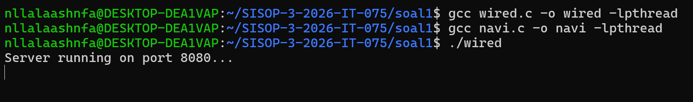

2. Buka terminal baru lalu Client connect dan registrasi nama (client 1)

```
./navi
```
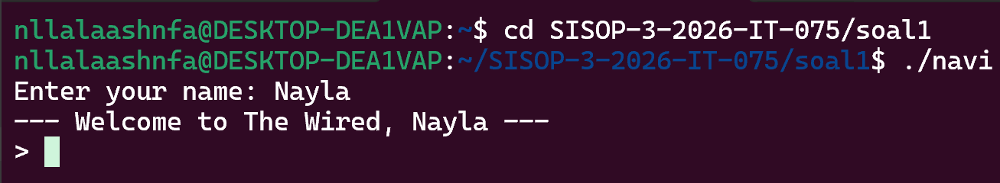

3. Buktiin kalau menggunakan nama yang sama tidak bisa dan langsung disuruh isi nama baru (client 2)

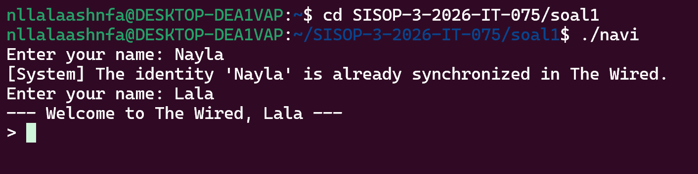


4. 2 client saling terconnect dan bisa saling chattan

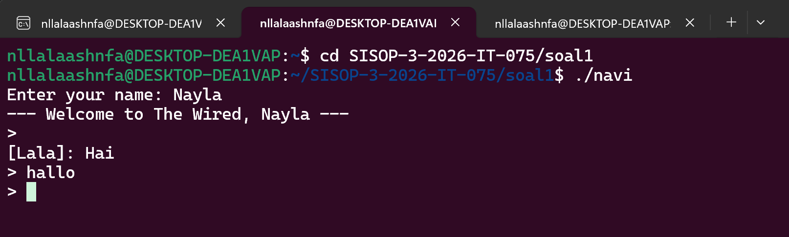
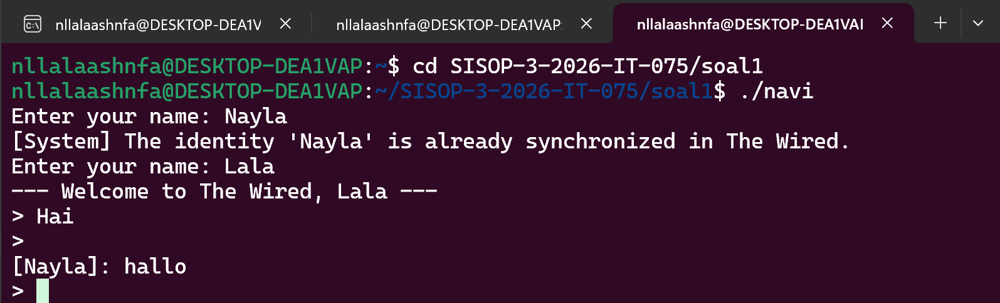 5.13

5. Membuktikan /exit pada salah satu terminal

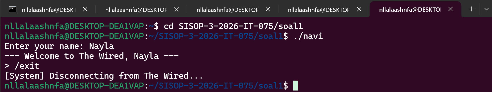

6. Buka terminal baru lalu input nama admin (Admin login)

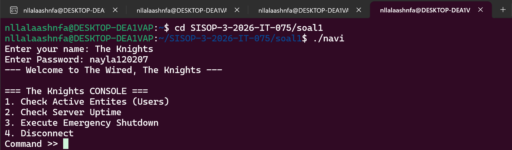

yang terjadi kalau passwordnya salah
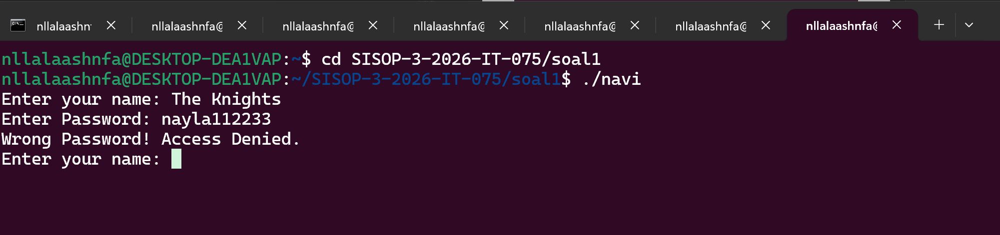

7. Admin cek user aktif (pilih 1)

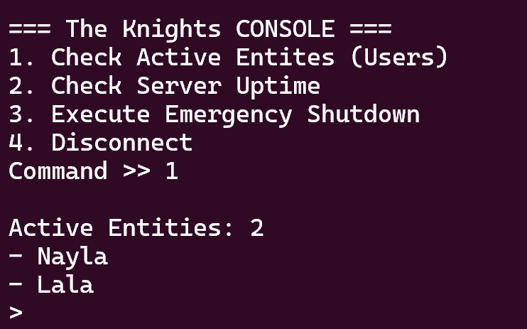

8. Admin cek uptime (pilih 2)

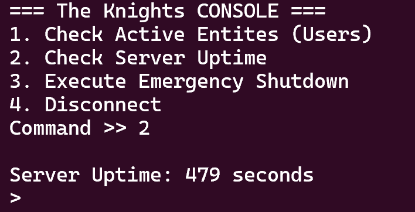

9. Emergency shutdown (pilih 3)

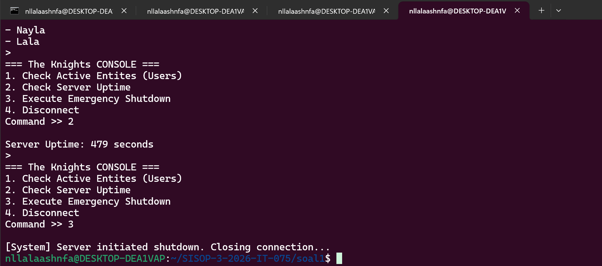
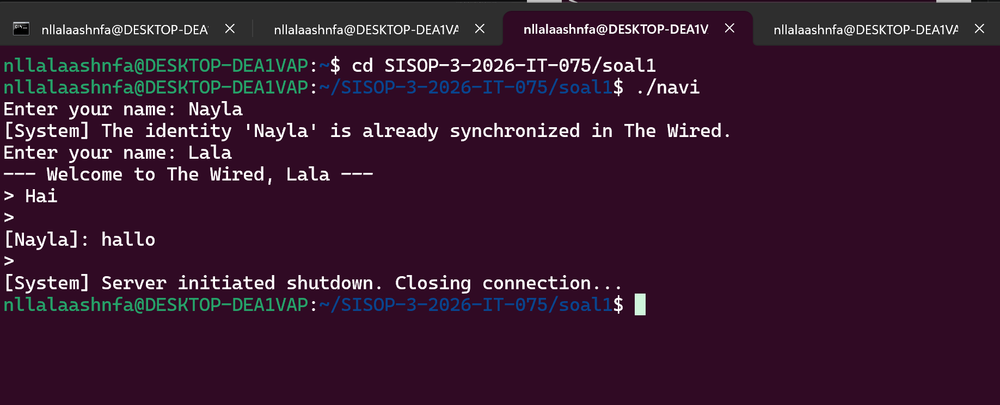
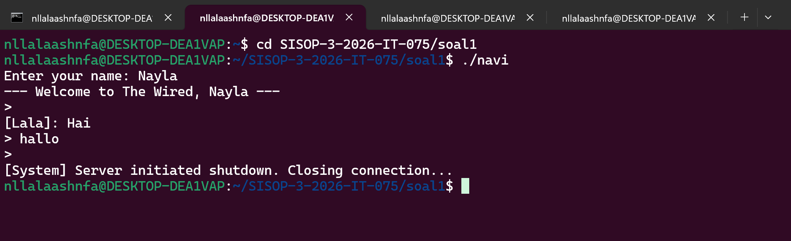
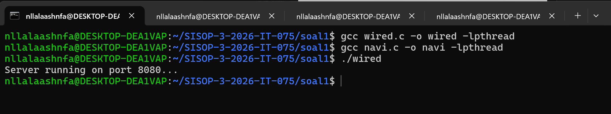

semua terminal akan tertutup secara otomatis secara bersamaan 

10. Disconnect diterminal tersebut saja (hanya diterminal admin, tidak disconnect diterminal lainnya) (pilih 4)

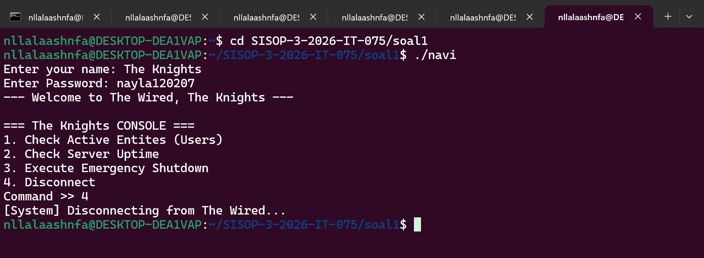


11. Isi `history.log` setelah sesi berjalan

```
cat hirtory.log
```
atau
```
tail -f history.log
```


---

#### Kendala

Jujur lumayan kesusahan untuk modul 3 sisop ini, kurang paham materinya ataupun kodingannya. Lumayan kesusahan juga arena waktu pengerjaannya pendek ditambah dengan tugas dan kegiatan lainnya datang secara bersamaan..